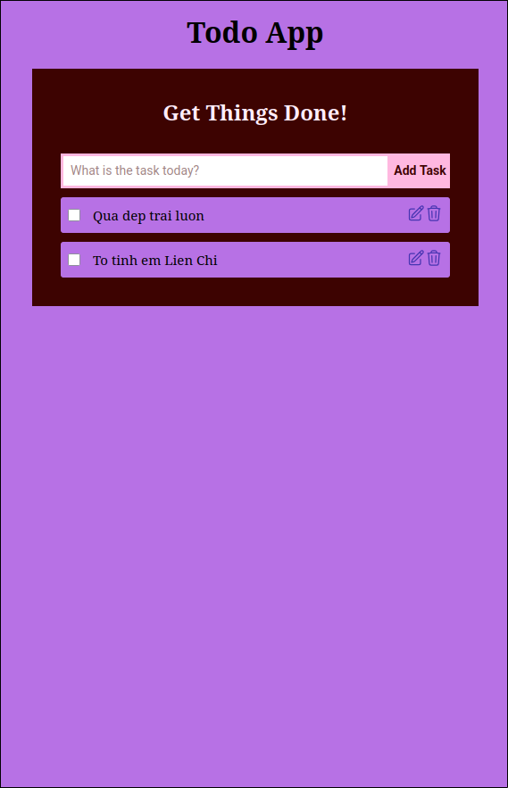

# Todo App

A simple Todo App built with **Vue.js** and **IndexedDB** for local storage.

## Technologies Used

- [Vue.js](https://vuejs.org/) – Frontend framework for building reactive UI.
- IndexedDB – Client-side database for persistent storage.

## Installation

1. Clone the repository:

   ```sh
   git clone https://github.com/2giosangmitom/todolist-vue.git
   cd todolist-vue
   ```

2. Install dependencies:

   ```sh
   npm install
   ```

3. Run the development server:

   ```sh
   npm run dev
   ```

## Preview



## Contributing

Contributions are welcome! Feel free to fork the repo and submit pull requests.
